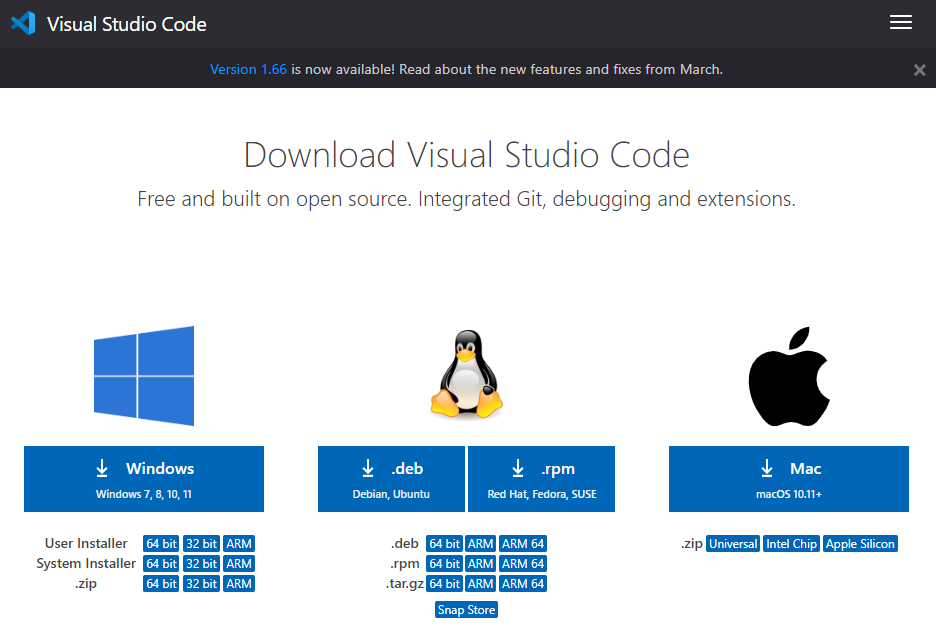

# CSE15L Lab Report 1 (Week 2)

This blog post is written as Lab Report 1 for CSE15L. This post will discuss remote access (as well as related topics like moving files between computers and setting SSH keys) and terve as a tutorial for logging into a course-specific account on ieng6. 

## Installing VScode
To install VSCode, I nagivated to the [Visual Studio Code site](https://code.visualstudio.com/download) and downloaded the version corresponding to my operating system (Windows). There are also versions for all other major operating systems.

![VSCode Home Page]

## Remotely Connecting

## Trying Some Commands

## Moving Files with SCP

## Setting an SSH Key

## Optimizing Remote Running
